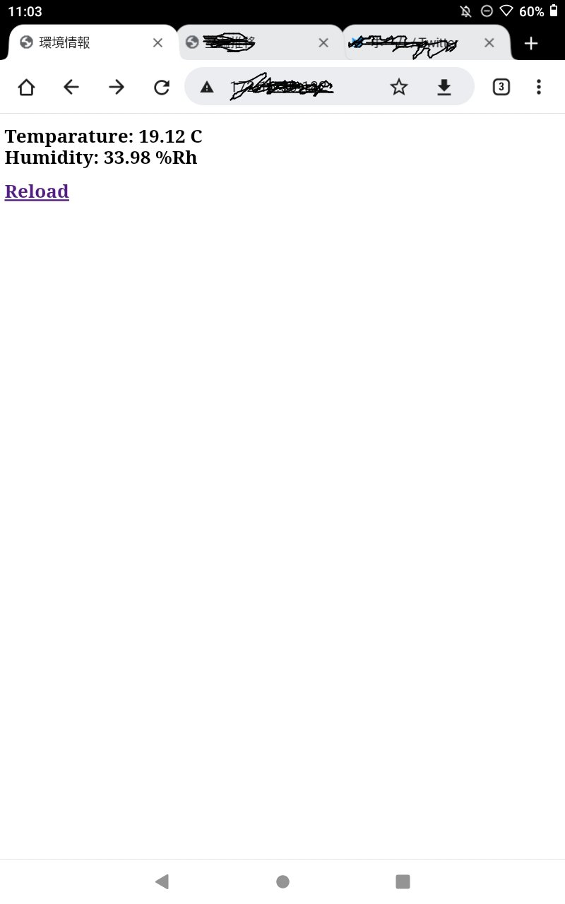

# 

## 概要 (Overview)

ESP32で高精度環境センサ(AHT25)を使い温度・湿度を観測します。

## 画面イメージ (ScreenShot)

## 動作要件 (Requirements)

M5stack (Basic) / C++ / PlatformIO / AHT25(Environment sensor) / Wi-Fi

## 回路図 (Circuit diagram)

|ESP32|AHT25|
|---|---|
|3.3V|VCC|
|SDA 21|SDA|
|GND|GND|
|SCL 22|SCL|

※See also AHT25 datasheet

## 引用 (Reference)

https://github.com/middle-river/weather_station

## ライセンス (License)

This software is released under the MIT License, see LICENSE.